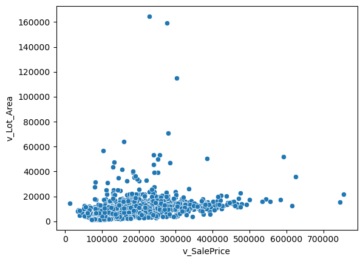
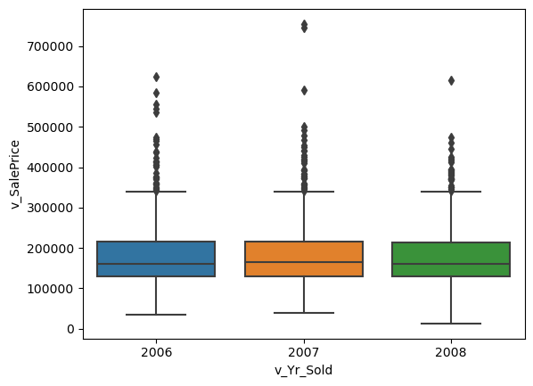

```python
import pandas as pd
from statsmodels.formula.api import ols as sm_ols
import numpy as np
import seaborn as sns
from statsmodels.iolib.summary2 import summary_col # nicer tables
```

## Part 1: EDA

_Insert cells as needed below to write a short EDA/data section that summarizes the data for someone who has never opened it before._ 
- Answer essential questions about the dataset (observation units, time period, sample size, many of the questions above) 
- Note any issues you have with the data (variable X has problem Y that needs to get addressed before using it in regressions or a prediction model because Z)
- Present any visual results you think are interesting or important


```python
housing = pd.read_csv('input_data2/housing_train.csv')
housing
```


<div>
<style scoped>
    .dataframe tbody tr th:only-of-type {
        vertical-align: middle;
    }

    .dataframe tbody tr th {
        vertical-align: top;
    }

    .dataframe thead th {
        text-align: right;
    }
</style>
<table border="1" class="dataframe">
  <thead>
    <tr style="text-align: right;">
      <th></th>
      <th>parcel</th>
      <th>v_MS_SubClass</th>
      <th>v_MS_Zoning</th>
      <th>v_Lot_Frontage</th>
      <th>v_Lot_Area</th>
      <th>v_Street</th>
      <th>v_Alley</th>
      <th>v_Lot_Shape</th>
      <th>v_Land_Contour</th>
      <th>v_Utilities</th>
      <th>...</th>
      <th>v_Pool_Area</th>
      <th>v_Pool_QC</th>
      <th>v_Fence</th>
      <th>v_Misc_Feature</th>
      <th>v_Misc_Val</th>
      <th>v_Mo_Sold</th>
      <th>v_Yr_Sold</th>
      <th>v_Sale_Type</th>
      <th>v_Sale_Condition</th>
      <th>v_SalePrice</th>
    </tr>
  </thead>
  <tbody>
    <tr>
      <th>0</th>
      <td>1056_528110080</td>
      <td>20</td>
      <td>RL</td>
      <td>107.0</td>
      <td>13891</td>
      <td>Pave</td>
      <td>NaN</td>
      <td>Reg</td>
      <td>Lvl</td>
      <td>AllPub</td>
      <td>...</td>
      <td>0</td>
      <td>NaN</td>
      <td>NaN</td>
      <td>NaN</td>
      <td>0</td>
      <td>1</td>
      <td>2008</td>
      <td>New</td>
      <td>Partial</td>
      <td>372402</td>
    </tr>
    <tr>
      <th>1</th>
      <td>1055_528108150</td>
      <td>20</td>
      <td>RL</td>
      <td>98.0</td>
      <td>12704</td>
      <td>Pave</td>
      <td>NaN</td>
      <td>Reg</td>
      <td>Lvl</td>
      <td>AllPub</td>
      <td>...</td>
      <td>0</td>
      <td>NaN</td>
      <td>NaN</td>
      <td>NaN</td>
      <td>0</td>
      <td>1</td>
      <td>2008</td>
      <td>New</td>
      <td>Partial</td>
      <td>317500</td>
    </tr>
    <tr>
      <th>2</th>
      <td>1053_528104050</td>
      <td>20</td>
      <td>RL</td>
      <td>114.0</td>
      <td>14803</td>
      <td>Pave</td>
      <td>NaN</td>
      <td>Reg</td>
      <td>Lvl</td>
      <td>AllPub</td>
      <td>...</td>
      <td>0</td>
      <td>NaN</td>
      <td>NaN</td>
      <td>NaN</td>
      <td>0</td>
      <td>6</td>
      <td>2008</td>
      <td>New</td>
      <td>Partial</td>
      <td>385000</td>
    </tr>
    <tr>
      <th>3</th>
      <td>2213_909275160</td>
      <td>20</td>
      <td>RL</td>
      <td>126.0</td>
      <td>13108</td>
      <td>Pave</td>
      <td>NaN</td>
      <td>IR2</td>
      <td>HLS</td>
      <td>AllPub</td>
      <td>...</td>
      <td>0</td>
      <td>NaN</td>
      <td>NaN</td>
      <td>NaN</td>
      <td>0</td>
      <td>6</td>
      <td>2007</td>
      <td>WD</td>
      <td>Normal</td>
      <td>153500</td>
    </tr>
    <tr>
      <th>4</th>
      <td>1051_528102030</td>
      <td>20</td>
      <td>RL</td>
      <td>96.0</td>
      <td>12444</td>
      <td>Pave</td>
      <td>NaN</td>
      <td>Reg</td>
      <td>Lvl</td>
      <td>AllPub</td>
      <td>...</td>
      <td>0</td>
      <td>NaN</td>
      <td>NaN</td>
      <td>NaN</td>
      <td>0</td>
      <td>11</td>
      <td>2008</td>
      <td>New</td>
      <td>Partial</td>
      <td>394617</td>
    </tr>
    <tr>
      <th>...</th>
      <td>...</td>
      <td>...</td>
      <td>...</td>
      <td>...</td>
      <td>...</td>
      <td>...</td>
      <td>...</td>
      <td>...</td>
      <td>...</td>
      <td>...</td>
      <td>...</td>
      <td>...</td>
      <td>...</td>
      <td>...</td>
      <td>...</td>
      <td>...</td>
      <td>...</td>
      <td>...</td>
      <td>...</td>
      <td>...</td>
      <td>...</td>
    </tr>
    <tr>
      <th>1936</th>
      <td>2524_534125210</td>
      <td>190</td>
      <td>RL</td>
      <td>79.0</td>
      <td>13110</td>
      <td>Pave</td>
      <td>NaN</td>
      <td>IR1</td>
      <td>Lvl</td>
      <td>AllPub</td>
      <td>...</td>
      <td>0</td>
      <td>NaN</td>
      <td>MnPrv</td>
      <td>NaN</td>
      <td>0</td>
      <td>7</td>
      <td>2006</td>
      <td>WD</td>
      <td>Normal</td>
      <td>146500</td>
    </tr>
    <tr>
      <th>1937</th>
      <td>2846_909131125</td>
      <td>190</td>
      <td>RH</td>
      <td>NaN</td>
      <td>7082</td>
      <td>Pave</td>
      <td>NaN</td>
      <td>Reg</td>
      <td>Lvl</td>
      <td>AllPub</td>
      <td>...</td>
      <td>0</td>
      <td>NaN</td>
      <td>NaN</td>
      <td>NaN</td>
      <td>0</td>
      <td>7</td>
      <td>2006</td>
      <td>WD</td>
      <td>Normal</td>
      <td>160000</td>
    </tr>
    <tr>
      <th>1938</th>
      <td>2605_535382020</td>
      <td>190</td>
      <td>RL</td>
      <td>60.0</td>
      <td>10800</td>
      <td>Pave</td>
      <td>NaN</td>
      <td>Reg</td>
      <td>Lvl</td>
      <td>AllPub</td>
      <td>...</td>
      <td>0</td>
      <td>NaN</td>
      <td>NaN</td>
      <td>NaN</td>
      <td>0</td>
      <td>5</td>
      <td>2006</td>
      <td>ConLD</td>
      <td>Normal</td>
      <td>160000</td>
    </tr>
    <tr>
      <th>1939</th>
      <td>1516_909101180</td>
      <td>190</td>
      <td>RL</td>
      <td>55.0</td>
      <td>5687</td>
      <td>Pave</td>
      <td>Grvl</td>
      <td>Reg</td>
      <td>Bnk</td>
      <td>AllPub</td>
      <td>...</td>
      <td>0</td>
      <td>NaN</td>
      <td>NaN</td>
      <td>NaN</td>
      <td>0</td>
      <td>3</td>
      <td>2008</td>
      <td>WD</td>
      <td>Normal</td>
      <td>135900</td>
    </tr>
    <tr>
      <th>1940</th>
      <td>1387_905200100</td>
      <td>190</td>
      <td>RL</td>
      <td>60.0</td>
      <td>12900</td>
      <td>Pave</td>
      <td>NaN</td>
      <td>Reg</td>
      <td>Lvl</td>
      <td>AllPub</td>
      <td>...</td>
      <td>0</td>
      <td>NaN</td>
      <td>NaN</td>
      <td>NaN</td>
      <td>0</td>
      <td>1</td>
      <td>2008</td>
      <td>WD</td>
      <td>Alloca</td>
      <td>95541</td>
    </tr>
  </tbody>
</table>
<p>1941 rows × 81 columns</p>
</div>


### Essential Questions:
The unit of observation is a house/property

The time period is the years 2006 to 2008, with a fairly even distribution of observations between those years

The parcel variable is a unique identifier for this dataset

The dataset has a sample size of 1941 observations

Many of the variables in this dataset are categorical, mostly describing different types of property or of certain features. For example:
- v_MS_Zoning: Identifies the general zoning classification of the sale.
- v_MS_SubClass: Identifies the type of dwelling involved in the sale
- v_Neighborhood: Physical locations within Ames city limits

Some variables in the dataset are continuous or discrete, with many showing the square footage of certain features of the property. For example:
- v_Lot_Area: Lot size in square feet
- v_Low_Qual_Fin_SF: Low quality finished square feet (all floors)
- v_Fireplaces: Number of fireplaces

### Potential Issues
Some variables have large amounts of missing data, however I believe these often just indicate a property that doesn't have whatever that variable is talking about. For example, v_Fence has 1,576 missing values, but when looking at the documentation, it is clear that properties without a fence are filled with NaN values

I was able to identify some outliers using scatterplots for v_SalePrice with one of the variables we will be using in the regressions, v_Lot_Area. This plot can be seen below.

The box plot showing the sales price by years also displays these outliers above the maximum sale price. This plot can be seen below


```python
sns.scatterplot(x='v_SalePrice', y='v_Lot_Area', data=housing)
```


    <AxesSubplot: xlabel='v_SalePrice', ylabel='v_Lot_Area'>


    

    


```python
sns.boxplot(x='v_Yr_Sold', y='v_SalePrice', data=housing)
```


    <AxesSubplot: xlabel='v_Yr_Sold', ylabel='v_SalePrice'>


    

    


### Data Visualization Takeaways
Continuous variables: Sales price and Lot Area - Seen above, this relationship seems linear, with some outliers

Categorical variables: Sales price and Year Sold - Seen above, this relationship also shows outliers in the sales price

## Part 2: Running Regressions

**Run these regressions on the RAW data, even if you found data issues that you think should be addressed.**

_Insert cells as needed below to run these regressions. Note that $i$ is indexing a given house, and $t$ indexes the year of sale._ 

1. $\text{Sale Price}_{i,t} = \alpha + \beta_1 * \text{v_Lot_Area}$
1. $\text{Sale Price}_{i,t} = \alpha + \beta_1 * log(\text{v_Lot_Area})$
1. $log(\text{Sale Price}_{i,t}) = \alpha + \beta_1 * \text{v_Lot_Area}$
1. $log(\text{Sale Price}_{i,t}) = \alpha + \beta_1 * log(\text{v_Lot_Area})$
1. $log(\text{Sale Price}_{i,t}) = \alpha + \beta_1 * \text{v_Yr_Sold}$
1. $log(\text{Sale Price}_{i,t}) = \alpha + \beta_1 * (\text{v_Yr_Sold==2007})+ \beta_2 * (\text{v_Yr_Sold==2008})$
1. Choose your own adventure: Pick any five variables from the dataset that you think will generate good R2. Use them in a regression of $log(\text{Sale Price}_{i,t})$ 
    - Tip: You can transform/create these five variables however you want, even if it creates extra variables. For example: I'd count Model 6 above as only using one variable: `v_Yr_Sold`.
    - I got an R2 of 0.877 with just "5" variables. How close can you get? I won't be shocked if someone beats that!
    

**Bonus formatting trick:** Instead of reporting all regressions separately, report all seven regressions in a _single_ table using `summary_col`.


```python
reg1 = sm_ols(
    "v_SalePrice ~ v_Lot_Area", data=housing
).fit()
reg1.summary()
```


<table class="simpletable">
<caption>OLS Regression Results</caption>
<tr>
  <th>Dep. Variable:</th>       <td>v_SalePrice</td>   <th>  R-squared:         </th> <td>   0.067</td> 
</tr>
<tr>
  <th>Model:</th>                   <td>OLS</td>       <th>  Adj. R-squared:    </th> <td>   0.066</td> 
</tr>
<tr>
  <th>Method:</th>             <td>Least Squares</td>  <th>  F-statistic:       </th> <td>   138.3</td> 
</tr>
<tr>
  <th>Date:</th>             <td>Sun, 02 Apr 2023</td> <th>  Prob (F-statistic):</th> <td>6.82e-31</td> 
</tr>
<tr>
  <th>Time:</th>                 <td>16:13:19</td>     <th>  Log-Likelihood:    </th> <td> -24610.</td> 
</tr>
<tr>
  <th>No. Observations:</th>      <td>  1941</td>      <th>  AIC:               </th> <td>4.922e+04</td>
</tr>
<tr>
  <th>Df Residuals:</th>          <td>  1939</td>      <th>  BIC:               </th> <td>4.924e+04</td>
</tr>
<tr>
  <th>Df Model:</th>              <td>     1</td>      <th>                     </th>     <td> </td>    
</tr>
<tr>
  <th>Covariance Type:</th>      <td>nonrobust</td>    <th>                     </th>     <td> </td>    
</tr>
</table>
<table class="simpletable">
<tr>
       <td></td>         <th>coef</th>     <th>std err</th>      <th>t</th>      <th>P>|t|</th>  <th>[0.025</th>    <th>0.975]</th>  
</tr>
<tr>
  <th>Intercept</th>  <td> 1.548e+05</td> <td> 2911.591</td> <td>   53.163</td> <td> 0.000</td> <td> 1.49e+05</td> <td>  1.6e+05</td>
</tr>
<tr>
  <th>v_Lot_Area</th> <td>    2.6489</td> <td>    0.225</td> <td>   11.760</td> <td> 0.000</td> <td>    2.207</td> <td>    3.091</td>
</tr>
</table>
<table class="simpletable">
<tr>
  <th>Omnibus:</th>       <td>668.513</td> <th>  Durbin-Watson:     </th> <td>   1.064</td>
</tr>
<tr>
  <th>Prob(Omnibus):</th> <td> 0.000</td>  <th>  Jarque-Bera (JB):  </th> <td>3001.894</td>
</tr>
<tr>
  <th>Skew:</th>          <td> 1.595</td>  <th>  Prob(JB):          </th> <td>    0.00</td>
</tr>
<tr>
  <th>Kurtosis:</th>      <td> 8.191</td>  <th>  Cond. No.          </th> <td>2.13e+04</td>
</tr>
</table><br/><br/>Notes:<br/>[1] Standard Errors assume that the covariance matrix of the errors is correctly specified.<br/>[2] The condition number is large, 2.13e+04. This might indicate that there are<br/>strong multicollinearity or other numerical problems.


```python
reg2 = sm_ols(
    "v_SalePrice ~ np.log(v_Lot_Area)", data=housing
).fit()
reg2.summary()
```


<table class="simpletable">
<caption>OLS Regression Results</caption>
<tr>
  <th>Dep. Variable:</th>       <td>v_SalePrice</td>   <th>  R-squared:         </th> <td>   0.128</td> 
</tr>
<tr>
  <th>Model:</th>                   <td>OLS</td>       <th>  Adj. R-squared:    </th> <td>   0.128</td> 
</tr>
<tr>
  <th>Method:</th>             <td>Least Squares</td>  <th>  F-statistic:       </th> <td>   285.6</td> 
</tr>
<tr>
  <th>Date:</th>             <td>Sun, 02 Apr 2023</td> <th>  Prob (F-statistic):</th> <td>6.95e-60</td> 
</tr>
<tr>
  <th>Time:</th>                 <td>16:13:19</td>     <th>  Log-Likelihood:    </th> <td> -24544.</td> 
</tr>
<tr>
  <th>No. Observations:</th>      <td>  1941</td>      <th>  AIC:               </th> <td>4.909e+04</td>
</tr>
<tr>
  <th>Df Residuals:</th>          <td>  1939</td>      <th>  BIC:               </th> <td>4.910e+04</td>
</tr>
<tr>
  <th>Df Model:</th>              <td>     1</td>      <th>                     </th>     <td> </td>    
</tr>
<tr>
  <th>Covariance Type:</th>      <td>nonrobust</td>    <th>                     </th>     <td> </td>    
</tr>
</table>
<table class="simpletable">
<tr>
           <td></td>             <th>coef</th>     <th>std err</th>      <th>t</th>      <th>P>|t|</th>  <th>[0.025</th>    <th>0.975]</th>  
</tr>
<tr>
  <th>Intercept</th>          <td>-3.279e+05</td> <td> 3.02e+04</td> <td>  -10.850</td> <td> 0.000</td> <td>-3.87e+05</td> <td>-2.69e+05</td>
</tr>
<tr>
  <th>np.log(v_Lot_Area)</th> <td> 5.603e+04</td> <td> 3315.139</td> <td>   16.901</td> <td> 0.000</td> <td> 4.95e+04</td> <td> 6.25e+04</td>
</tr>
</table>
<table class="simpletable">
<tr>
  <th>Omnibus:</th>       <td>650.067</td> <th>  Durbin-Watson:     </th> <td>   1.042</td>
</tr>
<tr>
  <th>Prob(Omnibus):</th> <td> 0.000</td>  <th>  Jarque-Bera (JB):  </th> <td>2623.687</td>
</tr>
<tr>
  <th>Skew:</th>          <td> 1.587</td>  <th>  Prob(JB):          </th> <td>    0.00</td>
</tr>
<tr>
  <th>Kurtosis:</th>      <td> 7.729</td>  <th>  Cond. No.          </th> <td>    164.</td>
</tr>
</table><br/><br/>Notes:<br/>[1] Standard Errors assume that the covariance matrix of the errors is correctly specified.


```python
reg3 = sm_ols(
    "np.log(v_SalePrice) ~ v_Lot_Area", data=housing
).fit()
reg3.summary()
```


<table class="simpletable">
<caption>OLS Regression Results</caption>
<tr>
  <th>Dep. Variable:</th>    <td>np.log(v_SalePrice)</td> <th>  R-squared:         </th> <td>   0.065</td>
</tr>
<tr>
  <th>Model:</th>                    <td>OLS</td>         <th>  Adj. R-squared:    </th> <td>   0.064</td>
</tr>
<tr>
  <th>Method:</th>              <td>Least Squares</td>    <th>  F-statistic:       </th> <td>   133.9</td>
</tr>
<tr>
  <th>Date:</th>              <td>Sun, 02 Apr 2023</td>   <th>  Prob (F-statistic):</th> <td>5.46e-30</td>
</tr>
<tr>
  <th>Time:</th>                  <td>16:13:19</td>       <th>  Log-Likelihood:    </th> <td> -927.19</td>
</tr>
<tr>
  <th>No. Observations:</th>       <td>  1941</td>        <th>  AIC:               </th> <td>   1858.</td>
</tr>
<tr>
  <th>Df Residuals:</th>           <td>  1939</td>        <th>  BIC:               </th> <td>   1870.</td>
</tr>
<tr>
  <th>Df Model:</th>               <td>     1</td>        <th>                     </th>     <td> </td>   
</tr>
<tr>
  <th>Covariance Type:</th>       <td>nonrobust</td>      <th>                     </th>     <td> </td>   
</tr>
</table>
<table class="simpletable">
<tr>
       <td></td>         <th>coef</th>     <th>std err</th>      <th>t</th>      <th>P>|t|</th>  <th>[0.025</th>    <th>0.975]</th>  
</tr>
<tr>
  <th>Intercept</th>  <td>   11.8941</td> <td>    0.015</td> <td>  813.211</td> <td> 0.000</td> <td>   11.865</td> <td>   11.923</td>
</tr>
<tr>
  <th>v_Lot_Area</th> <td> 1.309e-05</td> <td> 1.13e-06</td> <td>   11.571</td> <td> 0.000</td> <td> 1.09e-05</td> <td> 1.53e-05</td>
</tr>
</table>
<table class="simpletable">
<tr>
  <th>Omnibus:</th>       <td>75.460</td> <th>  Durbin-Watson:     </th> <td>   0.980</td>
</tr>
<tr>
  <th>Prob(Omnibus):</th> <td> 0.000</td> <th>  Jarque-Bera (JB):  </th> <td> 218.556</td>
</tr>
<tr>
  <th>Skew:</th>          <td>-0.066</td> <th>  Prob(JB):          </th> <td>3.48e-48</td>
</tr>
<tr>
  <th>Kurtosis:</th>      <td> 4.639</td> <th>  Cond. No.          </th> <td>2.13e+04</td>
</tr>
</table><br/><br/>Notes:<br/>[1] Standard Errors assume that the covariance matrix of the errors is correctly specified.<br/>[2] The condition number is large, 2.13e+04. This might indicate that there are<br/>strong multicollinearity or other numerical problems.


```python
reg4 = sm_ols(
    "np.log(v_SalePrice) ~ np.log(v_Lot_Area)", data=housing
).fit()
reg4.summary()
```


<table class="simpletable">
<caption>OLS Regression Results</caption>
<tr>
  <th>Dep. Variable:</th>    <td>np.log(v_SalePrice)</td> <th>  R-squared:         </th> <td>   0.135</td>
</tr>
<tr>
  <th>Model:</th>                    <td>OLS</td>         <th>  Adj. R-squared:    </th> <td>   0.135</td>
</tr>
<tr>
  <th>Method:</th>              <td>Least Squares</td>    <th>  F-statistic:       </th> <td>   302.5</td>
</tr>
<tr>
  <th>Date:</th>              <td>Sun, 02 Apr 2023</td>   <th>  Prob (F-statistic):</th> <td>4.38e-63</td>
</tr>
<tr>
  <th>Time:</th>                  <td>16:13:19</td>       <th>  Log-Likelihood:    </th> <td> -851.27</td>
</tr>
<tr>
  <th>No. Observations:</th>       <td>  1941</td>        <th>  AIC:               </th> <td>   1707.</td>
</tr>
<tr>
  <th>Df Residuals:</th>           <td>  1939</td>        <th>  BIC:               </th> <td>   1718.</td>
</tr>
<tr>
  <th>Df Model:</th>               <td>     1</td>        <th>                     </th>     <td> </td>   
</tr>
<tr>
  <th>Covariance Type:</th>       <td>nonrobust</td>      <th>                     </th>     <td> </td>   
</tr>
</table>
<table class="simpletable">
<tr>
           <td></td>             <th>coef</th>     <th>std err</th>      <th>t</th>      <th>P>|t|</th>  <th>[0.025</th>    <th>0.975]</th>  
</tr>
<tr>
  <th>Intercept</th>          <td>    9.4051</td> <td>    0.151</td> <td>   62.253</td> <td> 0.000</td> <td>    9.109</td> <td>    9.701</td>
</tr>
<tr>
  <th>np.log(v_Lot_Area)</th> <td>    0.2883</td> <td>    0.017</td> <td>   17.394</td> <td> 0.000</td> <td>    0.256</td> <td>    0.321</td>
</tr>
</table>
<table class="simpletable">
<tr>
  <th>Omnibus:</th>       <td>84.067</td> <th>  Durbin-Watson:     </th> <td>   0.955</td>
</tr>
<tr>
  <th>Prob(Omnibus):</th> <td> 0.000</td> <th>  Jarque-Bera (JB):  </th> <td> 255.283</td>
</tr>
<tr>
  <th>Skew:</th>          <td>-0.100</td> <th>  Prob(JB):          </th> <td>3.68e-56</td>
</tr>
<tr>
  <th>Kurtosis:</th>      <td> 4.765</td> <th>  Cond. No.          </th> <td>    164.</td>
</tr>
</table><br/><br/>Notes:<br/>[1] Standard Errors assume that the covariance matrix of the errors is correctly specified.


```python
reg5 = sm_ols(
    "np.log(v_SalePrice) ~ v_Yr_Sold", data=housing
).fit()
reg5.summary()
```


<table class="simpletable">
<caption>OLS Regression Results</caption>
<tr>
  <th>Dep. Variable:</th>    <td>np.log(v_SalePrice)</td> <th>  R-squared:         </th> <td>   0.000</td>
</tr>
<tr>
  <th>Model:</th>                    <td>OLS</td>         <th>  Adj. R-squared:    </th> <td>  -0.000</td>
</tr>
<tr>
  <th>Method:</th>              <td>Least Squares</td>    <th>  F-statistic:       </th> <td>  0.2003</td>
</tr>
<tr>
  <th>Date:</th>              <td>Sun, 02 Apr 2023</td>   <th>  Prob (F-statistic):</th>  <td> 0.655</td> 
</tr>
<tr>
  <th>Time:</th>                  <td>16:13:19</td>       <th>  Log-Likelihood:    </th> <td> -991.88</td>
</tr>
<tr>
  <th>No. Observations:</th>       <td>  1941</td>        <th>  AIC:               </th> <td>   1988.</td>
</tr>
<tr>
  <th>Df Residuals:</th>           <td>  1939</td>        <th>  BIC:               </th> <td>   1999.</td>
</tr>
<tr>
  <th>Df Model:</th>               <td>     1</td>        <th>                     </th>     <td> </td>   
</tr>
<tr>
  <th>Covariance Type:</th>       <td>nonrobust</td>      <th>                     </th>     <td> </td>   
</tr>
</table>
<table class="simpletable">
<tr>
      <td></td>         <th>coef</th>     <th>std err</th>      <th>t</th>      <th>P>|t|</th>  <th>[0.025</th>    <th>0.975]</th>  
</tr>
<tr>
  <th>Intercept</th> <td>   22.2932</td> <td>   22.937</td> <td>    0.972</td> <td> 0.331</td> <td>  -22.690</td> <td>   67.277</td>
</tr>
<tr>
  <th>v_Yr_Sold</th> <td>   -0.0051</td> <td>    0.011</td> <td>   -0.448</td> <td> 0.655</td> <td>   -0.028</td> <td>    0.017</td>
</tr>
</table>
<table class="simpletable">
<tr>
  <th>Omnibus:</th>       <td>55.641</td> <th>  Durbin-Watson:     </th> <td>   0.985</td>
</tr>
<tr>
  <th>Prob(Omnibus):</th> <td> 0.000</td> <th>  Jarque-Bera (JB):  </th> <td> 131.833</td>
</tr>
<tr>
  <th>Skew:</th>          <td> 0.075</td> <th>  Prob(JB):          </th> <td>2.36e-29</td>
</tr>
<tr>
  <th>Kurtosis:</th>      <td> 4.268</td> <th>  Cond. No.          </th> <td>5.03e+06</td>
</tr>
</table><br/><br/>Notes:<br/>[1] Standard Errors assume that the covariance matrix of the errors is correctly specified.<br/>[2] The condition number is large, 5.03e+06. This might indicate that there are<br/>strong multicollinearity or other numerical problems.


```python
reg6 = sm_ols(
    "np.log(v_SalePrice) ~ (v_Yr_Sold==2007) + (v_Yr_Sold==2008)", data=housing
).fit()
reg6.summary()
```


<table class="simpletable">
<caption>OLS Regression Results</caption>
<tr>
  <th>Dep. Variable:</th>    <td>np.log(v_SalePrice)</td> <th>  R-squared:         </th> <td>   0.001</td>
</tr>
<tr>
  <th>Model:</th>                    <td>OLS</td>         <th>  Adj. R-squared:    </th> <td>   0.000</td>
</tr>
<tr>
  <th>Method:</th>              <td>Least Squares</td>    <th>  F-statistic:       </th> <td>   1.394</td>
</tr>
<tr>
  <th>Date:</th>              <td>Sun, 02 Apr 2023</td>   <th>  Prob (F-statistic):</th>  <td> 0.248</td> 
</tr>
<tr>
  <th>Time:</th>                  <td>16:13:19</td>       <th>  Log-Likelihood:    </th> <td> -990.59</td>
</tr>
<tr>
  <th>No. Observations:</th>       <td>  1941</td>        <th>  AIC:               </th> <td>   1987.</td>
</tr>
<tr>
  <th>Df Residuals:</th>           <td>  1938</td>        <th>  BIC:               </th> <td>   2004.</td>
</tr>
<tr>
  <th>Df Model:</th>               <td>     2</td>        <th>                     </th>     <td> </td>   
</tr>
<tr>
  <th>Covariance Type:</th>       <td>nonrobust</td>      <th>                     </th>     <td> </td>   
</tr>
</table>
<table class="simpletable">
<tr>
              <td></td>                 <th>coef</th>     <th>std err</th>      <th>t</th>      <th>P>|t|</th>  <th>[0.025</th>    <th>0.975]</th>  
</tr>
<tr>
  <th>Intercept</th>                 <td>   12.0229</td> <td>    0.016</td> <td>  745.087</td> <td> 0.000</td> <td>   11.991</td> <td>   12.055</td>
</tr>
<tr>
  <th>v_Yr_Sold == 2007[T.True]</th> <td>    0.0256</td> <td>    0.022</td> <td>    1.150</td> <td> 0.250</td> <td>   -0.018</td> <td>    0.069</td>
</tr>
<tr>
  <th>v_Yr_Sold == 2008[T.True]</th> <td>   -0.0103</td> <td>    0.023</td> <td>   -0.450</td> <td> 0.653</td> <td>   -0.055</td> <td>    0.035</td>
</tr>
</table>
<table class="simpletable">
<tr>
  <th>Omnibus:</th>       <td>54.618</td> <th>  Durbin-Watson:     </th> <td>   0.989</td>
</tr>
<tr>
  <th>Prob(Omnibus):</th> <td> 0.000</td> <th>  Jarque-Bera (JB):  </th> <td> 127.342</td>
</tr>
<tr>
  <th>Skew:</th>          <td> 0.080</td> <th>  Prob(JB):          </th> <td>2.23e-28</td>
</tr>
<tr>
  <th>Kurtosis:</th>      <td> 4.245</td> <th>  Cond. No.          </th> <td>    3.79</td>
</tr>
</table><br/><br/>Notes:<br/>[1] Standard Errors assume that the covariance matrix of the errors is correctly specified.


```python
reg7 = sm_ols(
    "np.log(v_SalePrice) ~ v_Neighborhood + v_MS_SubClass + v_Low_Qual_Fin_SF + v_Fireplaces + v_Year_Built", data=housing
).fit()
reg7.summary()
```


<table class="simpletable">
<caption>OLS Regression Results</caption>
<tr>
  <th>Dep. Variable:</th>    <td>np.log(v_SalePrice)</td> <th>  R-squared:         </th> <td>   0.684</td>
</tr>
<tr>
  <th>Model:</th>                    <td>OLS</td>         <th>  Adj. R-squared:    </th> <td>   0.679</td>
</tr>
<tr>
  <th>Method:</th>              <td>Least Squares</td>    <th>  F-statistic:       </th> <td>   133.1</td>
</tr>
<tr>
  <th>Date:</th>              <td>Sun, 02 Apr 2023</td>   <th>  Prob (F-statistic):</th>  <td>  0.00</td> 
</tr>
<tr>
  <th>Time:</th>                  <td>16:13:19</td>       <th>  Log-Likelihood:    </th> <td>  125.02</td>
</tr>
<tr>
  <th>No. Observations:</th>       <td>  1941</td>        <th>  AIC:               </th> <td>  -186.0</td>
</tr>
<tr>
  <th>Df Residuals:</th>           <td>  1909</td>        <th>  BIC:               </th> <td>  -7.779</td>
</tr>
<tr>
  <th>Df Model:</th>               <td>    31</td>        <th>                     </th>     <td> </td>   
</tr>
<tr>
  <th>Covariance Type:</th>       <td>nonrobust</td>      <th>                     </th>     <td> </td>   
</tr>
</table>
<table class="simpletable">
<tr>
              <td></td>                 <th>coef</th>     <th>std err</th>      <th>t</th>      <th>P>|t|</th>  <th>[0.025</th>    <th>0.975]</th>  
</tr>
<tr>
  <th>Intercept</th>                 <td>    4.5093</td> <td>    0.739</td> <td>    6.104</td> <td> 0.000</td> <td>    3.060</td> <td>    5.958</td>
</tr>
<tr>
  <th>v_Neighborhood[T.Blueste]</th> <td>   -0.2082</td> <td>    0.126</td> <td>   -1.656</td> <td> 0.098</td> <td>   -0.455</td> <td>    0.038</td>
</tr>
<tr>
  <th>v_Neighborhood[T.BrDale]</th>  <td>   -0.3727</td> <td>    0.073</td> <td>   -5.087</td> <td> 0.000</td> <td>   -0.516</td> <td>   -0.229</td>
</tr>
<tr>
  <th>v_Neighborhood[T.BrkSide]</th> <td>   -0.2105</td> <td>    0.064</td> <td>   -3.285</td> <td> 0.001</td> <td>   -0.336</td> <td>   -0.085</td>
</tr>
<tr>
  <th>v_Neighborhood[T.ClearCr]</th> <td>    0.0662</td> <td>    0.068</td> <td>    0.975</td> <td> 0.330</td> <td>   -0.067</td> <td>    0.199</td>
</tr>
<tr>
  <th>v_Neighborhood[T.CollgCr]</th> <td>    0.0531</td> <td>    0.055</td> <td>    0.969</td> <td> 0.333</td> <td>   -0.054</td> <td>    0.160</td>
</tr>
<tr>
  <th>v_Neighborhood[T.Crawfor]</th> <td>    0.1379</td> <td>    0.062</td> <td>    2.227</td> <td> 0.026</td> <td>    0.016</td> <td>    0.259</td>
</tr>
<tr>
  <th>v_Neighborhood[T.Edwards]</th> <td>   -0.2070</td> <td>    0.058</td> <td>   -3.557</td> <td> 0.000</td> <td>   -0.321</td> <td>   -0.093</td>
</tr>
<tr>
  <th>v_Neighborhood[T.Gilbert]</th> <td>   -0.0473</td> <td>    0.056</td> <td>   -0.843</td> <td> 0.399</td> <td>   -0.157</td> <td>    0.063</td>
</tr>
<tr>
  <th>v_Neighborhood[T.Greens]</th>  <td>   -0.0720</td> <td>    0.115</td> <td>   -0.626</td> <td> 0.531</td> <td>   -0.297</td> <td>    0.153</td>
</tr>
<tr>
  <th>v_Neighborhood[T.GrnHill]</th> <td>    0.4378</td> <td>    0.170</td> <td>    2.578</td> <td> 0.010</td> <td>    0.105</td> <td>    0.771</td>
</tr>
<tr>
  <th>v_Neighborhood[T.IDOTRR]</th>  <td>   -0.3038</td> <td>    0.065</td> <td>   -4.688</td> <td> 0.000</td> <td>   -0.431</td> <td>   -0.177</td>
</tr>
<tr>
  <th>v_Neighborhood[T.Landmrk]</th> <td>   -0.1571</td> <td>    0.235</td> <td>   -0.669</td> <td> 0.503</td> <td>   -0.617</td> <td>    0.303</td>
</tr>
<tr>
  <th>v_Neighborhood[T.MeadowV]</th> <td>   -0.4835</td> <td>    0.070</td> <td>   -6.879</td> <td> 0.000</td> <td>   -0.621</td> <td>   -0.346</td>
</tr>
<tr>
  <th>v_Neighborhood[T.Mitchel]</th> <td>   -0.1097</td> <td>    0.059</td> <td>   -1.858</td> <td> 0.063</td> <td>   -0.226</td> <td>    0.006</td>
</tr>
<tr>
  <th>v_Neighborhood[T.NAmes]</th>   <td>   -0.1327</td> <td>    0.056</td> <td>   -2.358</td> <td> 0.018</td> <td>   -0.243</td> <td>   -0.022</td>
</tr>
<tr>
  <th>v_Neighborhood[T.NPkVill]</th> <td>   -0.1467</td> <td>    0.093</td> <td>   -1.584</td> <td> 0.113</td> <td>   -0.328</td> <td>    0.035</td>
</tr>
<tr>
  <th>v_Neighborhood[T.NWAmes]</th>  <td>    0.0283</td> <td>    0.058</td> <td>    0.484</td> <td> 0.629</td> <td>   -0.086</td> <td>    0.143</td>
</tr>
<tr>
  <th>v_Neighborhood[T.NoRidge]</th> <td>    0.4514</td> <td>    0.061</td> <td>    7.350</td> <td> 0.000</td> <td>    0.331</td> <td>    0.572</td>
</tr>
<tr>
  <th>v_Neighborhood[T.NridgHt]</th> <td>    0.3878</td> <td>    0.056</td> <td>    6.917</td> <td> 0.000</td> <td>    0.278</td> <td>    0.498</td>
</tr>
<tr>
  <th>v_Neighborhood[T.OldTown]</th> <td>   -0.1142</td> <td>    0.062</td> <td>   -1.827</td> <td> 0.068</td> <td>   -0.237</td> <td>    0.008</td>
</tr>
<tr>
  <th>v_Neighborhood[T.SWISU]</th>   <td>   -0.0695</td> <td>    0.073</td> <td>   -0.948</td> <td> 0.343</td> <td>   -0.213</td> <td>    0.074</td>
</tr>
<tr>
  <th>v_Neighborhood[T.Sawyer]</th>  <td>   -0.1656</td> <td>    0.059</td> <td>   -2.823</td> <td> 0.005</td> <td>   -0.281</td> <td>   -0.051</td>
</tr>
<tr>
  <th>v_Neighborhood[T.SawyerW]</th> <td>    0.0197</td> <td>    0.059</td> <td>    0.334</td> <td> 0.739</td> <td>   -0.096</td> <td>    0.136</td>
</tr>
<tr>
  <th>v_Neighborhood[T.Somerst]</th> <td>    0.1561</td> <td>    0.055</td> <td>    2.814</td> <td> 0.005</td> <td>    0.047</td> <td>    0.265</td>
</tr>
<tr>
  <th>v_Neighborhood[T.StoneBr]</th> <td>    0.4416</td> <td>    0.064</td> <td>    6.945</td> <td> 0.000</td> <td>    0.317</td> <td>    0.566</td>
</tr>
<tr>
  <th>v_Neighborhood[T.Timber]</th>  <td>    0.1678</td> <td>    0.061</td> <td>    2.735</td> <td> 0.006</td> <td>    0.047</td> <td>    0.288</td>
</tr>
<tr>
  <th>v_Neighborhood[T.Veenker]</th> <td>    0.1494</td> <td>    0.073</td> <td>    2.042</td> <td> 0.041</td> <td>    0.006</td> <td>    0.293</td>
</tr>
<tr>
  <th>v_MS_SubClass</th>             <td>   -0.0003</td> <td>    0.000</td> <td>   -2.180</td> <td> 0.029</td> <td>   -0.001</td> <td>-3.08e-05</td>
</tr>
<tr>
  <th>v_Low_Qual_Fin_SF</th>         <td>    0.0003</td> <td>    0.000</td> <td>    2.086</td> <td> 0.037</td> <td> 1.57e-05</td> <td>    0.001</td>
</tr>
<tr>
  <th>v_Fireplaces</th>              <td>    0.1905</td> <td>    0.009</td> <td>   21.120</td> <td> 0.000</td> <td>    0.173</td> <td>    0.208</td>
</tr>
<tr>
  <th>v_Year_Built</th>              <td>    0.0038</td> <td>    0.000</td> <td>   10.269</td> <td> 0.000</td> <td>    0.003</td> <td>    0.004</td>
</tr>
</table>
<table class="simpletable">
<tr>
  <th>Omnibus:</th>       <td>298.259</td> <th>  Durbin-Watson:     </th> <td>   1.671</td>
</tr>
<tr>
  <th>Prob(Omnibus):</th> <td> 0.000</td>  <th>  Jarque-Bera (JB):  </th> <td>2429.518</td>
</tr>
<tr>
  <th>Skew:</th>          <td>-0.467</td>  <th>  Prob(JB):          </th> <td>    0.00</td>
</tr>
<tr>
  <th>Kurtosis:</th>      <td> 8.401</td>  <th>  Cond. No.          </th> <td>2.83e+05</td>
</tr>
</table><br/><br/>Notes:<br/>[1] Standard Errors assume that the covariance matrix of the errors is correctly specified.<br/>[2] The condition number is large, 2.83e+05. This might indicate that there are<br/>strong multicollinearity or other numerical problems.


```python
# Print combined regression table (copied from class notes)

# now I'll format an output table
# I'd like to include extra info in the table (not just coefficients)
info_dict={'R-squared' : lambda x: f"{x.rsquared:.2f}",
           'Adj R-squared' : lambda x: f"{x.rsquared_adj:.2f}",
           'No. observations' : lambda x: f"{int(x.nobs):d}"}

# q4b1 and q4b2 name the dummies differently in the table, so this is a silly fix
# reg4.model.exog_names[1:] = reg5.model.exog_names[1:]  

# This summary col function combines a bunch of regressions into one nice table
print('='*108)
# print('                  y = interest rate if not specified, log(interest rate else)')
print(summary_col(results=[reg1,reg2,reg3,reg4,reg5,reg6], # list the result obj here
                  float_format='%0.2f',
                  stars = True, # stars are easy way to see if anything is statistically significant
                  model_names=['1','2',' 3 ','4 ','5','6'], # these are bad names, lol. Usually, just use the y variable name
                  info_dict=info_dict,
                  # regressor_order=[ 'Intercept','Borrower_Credit_Score_at_Origination','l_credscore','l_LTV','l_credscore:l_LTV',
                  #                 'C(creditbins)[Very Poor]','C(creditbins)[Fair]','C(creditbins)[Good]','C(creditbins)[Vrey Good]','C(creditbins)[Exceptional]']
                  )
     )
```

    ============================================================================================================
    
    ======================================================================================
                                   1             2          3        4       5       6    
    --------------------------------------------------------------------------------------
    Intercept                 154789.55*** -327915.80*** 11.89*** 9.41*** 22.29   12.02***
                              (2911.59)    (30221.35)    (0.01)   (0.15)  (22.94) (0.02)  
    R-squared                 0.07         0.13          0.06     0.13    0.00    0.00    
    R-squared Adj.            0.07         0.13          0.06     0.13    -0.00   0.00    
    np.log(v_Lot_Area)                     56028.17***            0.29***                 
                                           (3315.14)              (0.02)                  
    v_Lot_Area                2.65***                    0.00***                          
                              (0.23)                     (0.00)                           
    v_Yr_Sold                                                             -0.01           
                                                                          (0.01)          
    v_Yr_Sold == 2007[T.True]                                                     0.03    
                                                                                  (0.02)  
    v_Yr_Sold == 2008[T.True]                                                     -0.01   
                                                                                  (0.02)  
    R-squared                 0.07         0.13          0.06     0.13    0.00    0.00    
    Adj R-squared             0.07         0.13          0.06     0.13    -0.00   0.00    
    No. observations          1941         1941          1941     1941    1941    1941    
    ======================================================================================
    Standard errors in parentheses.
    * p<.1, ** p<.05, ***p<.01


## Part 3: Regression interpretation

_Insert cells as needed below to answer these questions. Note that $i$ is indexing a given house, and $t$ indexes the year of sale._ 

1. If you didn't use the `summary_col` trick, list $\beta_1$ for Models 1-6 to make it easier on your graders.
1. Interpret $\beta_1$ in Model 2. 
1. Interpret $\beta_1$ in Model 3. 
    - HINT: You might need to print out more decimal places. Show at least 2 non-zero digits. 
1. Of models 1-4, which do you think best explains the data and why?
1. Interpret $\beta_1$ In Model 5
1. Interpret $\alpha$ in Model 6
1. Interpret $\beta_1$ in Model 6
1. Why is the R2 of Model 6 higher than the R2 of Model 5?
1. What variables did you include in Model 7?
1. What is the R2 of your Model 7?
1. Speculate (not graded): Could you use the specification of Model 6 in a predictive regression? 
1. Speculate (not graded): Could you use the specification of Model 5 in a predictive regression? 


### Question 1:
Printed summary table above

### Question 2:
- When lot area goes up by 1%, the sale price of the home increases by \\$560.28 holding all other X constant
- If the lot area goes from 1000 to 1010 --> Sale price increases by \\$560.28

### Question 3:
- When lot area goes up by 1, the sale price of the home increases by .001309% holding all other X constant

### Question 4:
I think that model 4 best explains the data becaus it has the highest r2 and I think using the log function on both the sale price and lot area makes the most sense for this model. Since model 4 has the highest r2 out of thise models, that means that the model can explain more of the variation in the sale price compared to the other models. Additionally, because of the EDA I preformed above, I think taking the log of both variables makes the most sense. This helps to normalize the distribution, reducing the effect of the outliers that I identified in part 1.

### Question 5:
When year sold goes up by 1, the sale price of the home decreases by 0.51%  holding all other X constant

### Question 6:
- For homes sold in the year 2006, the average value of the log of sale price is 12.0229

### Question 7:
- The sale price is about 2.56% higher on average for homes sold in 2007 than homes sold in 2008

### Question 8:
The r2 of model 6 is higher than the r2 of model 5 because there is more correlation between the sales price and the sales year when the year is 2007 or 2008. The model explains the variation in sales price better when the year 2006 is omitted.

### Question 9:
The variables I included were:

- v_Neighborhood: Physical locations within Ames city limits
- v_MS_SubClass: Identifies the type of dwelling involved in the sale
- v_Low_Qual_Fin_SF: Low quality finished square feet (all floors)
- v_Fireplaces: Number of fireplaces
- v_Year_Built: Original construction date

### Question 10:
**0.684**

### Question 11:
Model 6 is just comparing the difference in sales prices between the year 2007 and 2008. Since this model is specific to those years, I don't think it could be used in a predictive regression. Additionally, the model could be somewhat irregular due to the housing crisis in 2008, so I think that is another reason it wouldn't be good to use as a predictive regression.

### Question 12:
Model 5 is showing the relationship between the sales price and year sold in general, so I think you could use it for a predictive regression, but it's not Ideal. It would definitely be better than model 6, but it only takes into account 3 years, one of those being 2008 which could cause irregularities in the model due to the housing crisis. Ideally, a model that takes into account more years of data would be better for a predictive regression.
