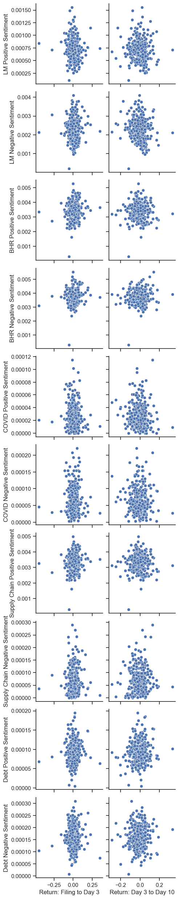

# Tim DiPalo: Midterm Project - S&P500 10k Sentiment Analysis

## Project Summary

In this project, I aim to answer the question: How does the tone and sentiment of S&P500 companies' 10k's correlate with their stock returns after the filing of their 10k? To analyze this, I gathered stock return data and created measures that accurately represent stock returns after the filing of companies’ 10k’s. To do so, I created two measures. The first measure was the “buy and hold” return from the companies filing date to two days after. The second measure was the “buy and hold” return from three days after to ten days after. Then I created ten sentiment scores, rating each 10k on their positive and negative tone, for both general words and topic-specific words.


My findings are not what I would have expected, but they are fairly consistent with Table 3 of the Garcia, Hu, and Rohrer paper. I expected to see positive correlations from the positive sentiment variables, and vise-verse, but this is not what I found. However, I did find useful correlations from the topic variables that I chose, and used those to analyze potential economic implications. Overall, this project provides useful insights on the tone of 10k documents, and their relationship to stock returns.

## Data

### The Sample
I used a list of S&P500 firms to gather the 10k data, and a data from CRSP containing daily returns from 2022 for many firms.

### The Dataset


```python
import numpy as np
import pandas as pd
```


```python
Analysis_Sample = pd.read_csv('outputs/analysis_sample.csv')
```


```python
# Just showing returns and sentiment scores, not all the ccm accounting data
Analysis_Sample.iloc[:, :13]
```


<div>
<style scoped>
    .dataframe tbody tr th:only-of-type {
        vertical-align: middle;
    }

    .dataframe tbody tr th {
        vertical-align: top;
    }

    .dataframe thead th {
        text-align: right;
    }
</style>
<table border="1" class="dataframe">
  <thead>
    <tr style="text-align: right;">
      <th></th>
      <th>Ticker</th>
      <th>Return: Filing to Day 3</th>
      <th>Return: Day 3 to Day 10</th>
      <th>LM Positive Sentiment</th>
      <th>LM Negative Sentiment</th>
      <th>BHR Positive Sentiment</th>
      <th>BHR Negative Sentiment</th>
      <th>COVID Positive Sentiment</th>
      <th>COVID Negative Sentiment</th>
      <th>Supply Chain Positive Sentiment</th>
      <th>Supply Chain Negative Sentiment</th>
      <th>Debt Positive Sentiment</th>
      <th>Debt Negative Sentiment</th>
    </tr>
  </thead>
  <tbody>
    <tr>
      <th>0</th>
      <td>MMM</td>
      <td>-0.017671</td>
      <td>-0.090256</td>
      <td>0.000461</td>
      <td>0.002695</td>
      <td>0.002977</td>
      <td>0.003670</td>
      <td>0.000029</td>
      <td>0.000061</td>
      <td>0.002820</td>
      <td>0.000058</td>
      <td>0.000091</td>
      <td>0.000238</td>
    </tr>
    <tr>
      <th>1</th>
      <td>AOS</td>
      <td>0.003184</td>
      <td>-0.053547</td>
      <td>0.000533</td>
      <td>0.001843</td>
      <td>0.003473</td>
      <td>0.003351</td>
      <td>0.000017</td>
      <td>0.000050</td>
      <td>0.003372</td>
      <td>0.000101</td>
      <td>0.000118</td>
      <td>0.000164</td>
    </tr>
    <tr>
      <th>2</th>
      <td>ABBV</td>
      <td>0.012347</td>
      <td>0.018329</td>
      <td>0.000822</td>
      <td>0.001959</td>
      <td>0.002504</td>
      <td>0.002871</td>
      <td>0.000031</td>
      <td>0.000058</td>
      <td>0.002432</td>
      <td>0.000035</td>
      <td>0.000089</td>
      <td>0.000159</td>
    </tr>
    <tr>
      <th>3</th>
      <td>ACN</td>
      <td>0.003446</td>
      <td>0.107431</td>
      <td>0.001278</td>
      <td>0.002494</td>
      <td>0.004137</td>
      <td>0.003545</td>
      <td>0.000006</td>
      <td>0.000009</td>
      <td>0.004043</td>
      <td>0.000031</td>
      <td>0.000071</td>
      <td>0.000074</td>
    </tr>
    <tr>
      <th>4</th>
      <td>ADBE</td>
      <td>-0.015915</td>
      <td>0.021523</td>
      <td>0.001558</td>
      <td>0.002335</td>
      <td>0.003888</td>
      <td>0.003553</td>
      <td>0.000030</td>
      <td>0.000064</td>
      <td>0.003791</td>
      <td>0.000013</td>
      <td>0.000097</td>
      <td>0.000122</td>
    </tr>
    <tr>
      <th>...</th>
      <td>...</td>
      <td>...</td>
      <td>...</td>
      <td>...</td>
      <td>...</td>
      <td>...</td>
      <td>...</td>
      <td>...</td>
      <td>...</td>
      <td>...</td>
      <td>...</td>
      <td>...</td>
      <td>...</td>
    </tr>
    <tr>
      <th>343</th>
      <td>WYNN</td>
      <td>0.009798</td>
      <td>-0.245402</td>
      <td>0.000548</td>
      <td>0.002610</td>
      <td>0.003143</td>
      <td>0.003203</td>
      <td>0.000052</td>
      <td>0.000061</td>
      <td>0.003063</td>
      <td>0.000004</td>
      <td>0.000080</td>
      <td>0.000219</td>
    </tr>
    <tr>
      <th>344</th>
      <td>XEL</td>
      <td>0.019563</td>
      <td>0.038822</td>
      <td>0.000356</td>
      <td>0.001414</td>
      <td>0.002593</td>
      <td>0.003587</td>
      <td>0.000007</td>
      <td>0.000022</td>
      <td>0.002558</td>
      <td>0.000056</td>
      <td>0.000063</td>
      <td>0.000147</td>
    </tr>
    <tr>
      <th>345</th>
      <td>XYL</td>
      <td>-0.010718</td>
      <td>-0.036192</td>
      <td>0.000995</td>
      <td>0.002470</td>
      <td>0.004413</td>
      <td>0.004401</td>
      <td>0.000047</td>
      <td>0.000088</td>
      <td>0.004180</td>
      <td>0.000123</td>
      <td>0.000069</td>
      <td>0.000152</td>
    </tr>
    <tr>
      <th>346</th>
      <td>ZBRA</td>
      <td>-0.157306</td>
      <td>-0.019582</td>
      <td>0.000869</td>
      <td>0.002078</td>
      <td>0.003943</td>
      <td>0.003727</td>
      <td>0.000027</td>
      <td>0.000033</td>
      <td>0.003840</td>
      <td>0.000047</td>
      <td>0.000095</td>
      <td>0.000171</td>
    </tr>
    <tr>
      <th>347</th>
      <td>ZTS</td>
      <td>-0.017105</td>
      <td>0.015538</td>
      <td>0.000740</td>
      <td>0.002937</td>
      <td>0.003203</td>
      <td>0.004926</td>
      <td>0.000030</td>
      <td>0.000081</td>
      <td>0.003153</td>
      <td>0.000097</td>
      <td>0.000064</td>
      <td>0.000157</td>
    </tr>
  </tbody>
</table>
<p>348 rows × 13 columns</p>
</div>


### Return Variable Creation

To create my return variables, I used the function `.rolling` to calculate the returns over a rolling window, from t to t+3 for the first variable, and from t+3 to t+10 for the second variable. TO actually calculate the returns, I used the following formula:

(1 + $R_{1}$)(1 + $R_{2}$)... – 1

The code I used for this is as follows: 

`.apply(lambda x: np.prod(1+x)-1)`

For the second variable calculating the return from t+3 to t+10, I needed to add an `.iloc` argument to shift the calculation to start at t+3. The code is as follows:

`.apply(lambda x: np.prod(1+x.iloc[3:])-1)`

Additionally, I used `.groupby` to group the calculation by ticker so it calculated the returns based on the specific firm. Finally, I used `.shift` to shift all of the returns up so that they aligned with the filing date, to make is easier to merge the correct returns that I needed later. I also used `.reset_index` to reset the index. The final code I used to calculate both return variables is as follows:

```python
ret_2022['ret_3'] = ret_2022.groupby('ticker')['ret'].rolling(3).apply(lambda x: np.prod(1+x)-1).shift(-2).reset_index(0, drop=True)

ret_2022['ret_10'] = ret_2022.groupby('ticker')['ret'].rolling(11).apply(lambda x: np.prod(1+x.iloc[3:])-1).shift(-10).reset_index(0, drop=True)
```

### Sentiment Variable Creation

#### LM and BHR:

With these lists already being defined for me the only thing I had to do before calculating their sentiment score was to format them correctly for the NEAR_regex function. The NEAR_regex function only accepts the list of words to search for in a very specific format, with words separated by a vertical bar, and the list inside of parenthesis and apostrophes. For example: '(happy|smile|good)'. Therefore, I had to use the following code to convert the LM and BHR lists to the correct format:

```python
regex = ['('+"|".join(LM_positive)+')']
```

#### Topic variables:

For the topic variables, I first had to define my list of words related the topic, formatted for NEAR_regex. My lists ranged from six to ten words. I then had to create a variable as a list of both my topic words, and the BHR positive/negative words to input into the NEAR_regex function. For example:

```python
covid_pos = [covid_words, '('+"|".join(BHR_positive)+')']
```

#### Creating Sentiment Scores:

After creating these variables, I was ready to loop over all of the 10k's to calculate the ten sentiment scores. I created a for loop that opened each 10k as an HTML file, cleaned it, and calculated each sentiment score. To calculate each score, I used the `len()` function and NEAR_regex to count all matching words and divide that by the total number of words in the 10k. I chose `max_words_between=5` because I felt like that was the maximum amount of words that could be between the words I was looking to match for them to be related and relevant. Finally, I used `.loc` to add these scores to the dataframe. For example:

```python
LM_pos_sentiment = (
len(re.findall(NEAR_regex(LM_positive_regex, partial=False, max_words_between=5), html_cleaned))
/
len(html_cleaned)
)
```

### Topic Variable Choices

#### Topic 1: COVID

Even throughout 2022, COVID is still heavily affecting firms in all industries. Although the pandemic has mostly settled down, I wanted to analyze how its effects still impact the S&P500 firms in 2022 and if these impacts have a significant effect on the firms' stock returns.

#### Topic 2: Supply Chain

Every since COVID derailed supply chains, issues related to logistics, transportation, and product availability have been consistent. By analyzing the sentiment related to supply chain, we will be able to identify which companies are dealing with these issues better than others, and how that impacts their stock returns.

#### Topic 3: Debt

Stepping away from topics that have only been super relevant recently, I wanted to analyze a topic that has a huge impact on firms in all industries of the S&P500. By analyzing the sentiment related to how firms handle their debt, we will be able to identify if/how their stock returns correlate with how firms discuss their debt in their 10k.

## Final Analysis Sample Summary Stats


```python
Analysis_Sample = pd.read_csv('outputs/analysis_sample.csv')
Analysis_Sample.iloc[:, :13].describe()
```


<div>
<style scoped>
    .dataframe tbody tr th:only-of-type {
        vertical-align: middle;
    }

    .dataframe tbody tr th {
        vertical-align: top;
    }

    .dataframe thead th {
        text-align: right;
    }
</style>
<table border="1" class="dataframe">
  <thead>
    <tr style="text-align: right;">
      <th></th>
      <th>Return: Filing to Day 3</th>
      <th>Return: Day 3 to Day 10</th>
      <th>LM Positive Sentiment</th>
      <th>LM Negative Sentiment</th>
      <th>BHR Positive Sentiment</th>
      <th>BHR Negative Sentiment</th>
      <th>COVID Positive Sentiment</th>
      <th>COVID Negative Sentiment</th>
      <th>Supply Chain Positive Sentiment</th>
      <th>Supply Chain Negative Sentiment</th>
      <th>Debt Positive Sentiment</th>
      <th>Debt Negative Sentiment</th>
    </tr>
  </thead>
  <tbody>
    <tr>
      <th>count</th>
      <td>348.000000</td>
      <td>345.000000</td>
      <td>348.000000</td>
      <td>348.000000</td>
      <td>348.000000</td>
      <td>348.000000</td>
      <td>348.000000</td>
      <td>348.000000</td>
      <td>348.000000</td>
      <td>348.000000</td>
      <td>348.000000</td>
      <td>348.000000</td>
    </tr>
    <tr>
      <th>mean</th>
      <td>0.004439</td>
      <td>-0.009637</td>
      <td>0.000715</td>
      <td>0.002280</td>
      <td>0.003407</td>
      <td>0.003710</td>
      <td>0.000027</td>
      <td>0.000064</td>
      <td>0.003312</td>
      <td>0.000066</td>
      <td>0.000092</td>
      <td>0.000161</td>
    </tr>
    <tr>
      <th>std</th>
      <td>0.059390</td>
      <td>0.066856</td>
      <td>0.000201</td>
      <td>0.000550</td>
      <td>0.000550</td>
      <td>0.000486</td>
      <td>0.000018</td>
      <td>0.000039</td>
      <td>0.000518</td>
      <td>0.000050</td>
      <td>0.000027</td>
      <td>0.000045</td>
    </tr>
    <tr>
      <th>min</th>
      <td>-0.447499</td>
      <td>-0.288483</td>
      <td>0.000110</td>
      <td>0.000216</td>
      <td>0.000303</td>
      <td>0.000281</td>
      <td>0.000000</td>
      <td>0.000003</td>
      <td>0.000303</td>
      <td>0.000000</td>
      <td>0.000005</td>
      <td>0.000008</td>
    </tr>
    <tr>
      <th>25%</th>
      <td>-0.025617</td>
      <td>-0.048351</td>
      <td>0.000591</td>
      <td>0.001935</td>
      <td>0.003082</td>
      <td>0.003407</td>
      <td>0.000014</td>
      <td>0.000035</td>
      <td>0.003014</td>
      <td>0.000025</td>
      <td>0.000075</td>
      <td>0.000129</td>
    </tr>
    <tr>
      <th>50%</th>
      <td>0.001237</td>
      <td>-0.012453</td>
      <td>0.000700</td>
      <td>0.002252</td>
      <td>0.003450</td>
      <td>0.003689</td>
      <td>0.000023</td>
      <td>0.000057</td>
      <td>0.003356</td>
      <td>0.000057</td>
      <td>0.000089</td>
      <td>0.000158</td>
    </tr>
    <tr>
      <th>75%</th>
      <td>0.031192</td>
      <td>0.029635</td>
      <td>0.000821</td>
      <td>0.002593</td>
      <td>0.003749</td>
      <td>0.003985</td>
      <td>0.000037</td>
      <td>0.000086</td>
      <td>0.003632</td>
      <td>0.000095</td>
      <td>0.000109</td>
      <td>0.000192</td>
    </tr>
    <tr>
      <th>max</th>
      <td>0.348567</td>
      <td>0.332299</td>
      <td>0.001558</td>
      <td>0.004095</td>
      <td>0.005266</td>
      <td>0.005528</td>
      <td>0.000115</td>
      <td>0.000221</td>
      <td>0.004989</td>
      <td>0.000291</td>
      <td>0.000195</td>
      <td>0.000309</td>
    </tr>
  </tbody>
</table>
</div>


### Contextual Sentiment Smell Tests

Based on different ways of viewing my analysis sample dataset, nothing seems fishy besides the one caveat I mentioned before. All of the variables have variation, and they generally line up with what I would expect. The LM and BHR sentiment scores are overall higher than the topic sentiment scores, as they find more matches in the 10k's since they are just looking for one word. Debt and COVID generally have higher negative scores, as those are topics that create issues for firms. The one thing that seems fishy, however, is that the Supply Chain Positive scores are significantly higher than the negative scores (0.002820 vs 0.000058 for MMM for example). I have a feeling that this has something to do with the methodology I used for that variable, as that big of a difference is very unlikely to be a result of the firm talking more positively about Supply Chain.

### Data Caveats to Know

The one major caveat that I noticed in my output data is that it only contains 348 firms out of the S&P500. I am aware that a couple of the firms may have missing data or some other issues, but I think 150 firms missing is a result of another issue with my analysis.

When merging my return variables into the S&P500 dataset, I needed the filing date to merge on, which I needed to acquire the firms accession number's and CIK's. After creating a mini-dataset with the accession number's and CIK's, I had 490 rows. After merging this to the S&P500 dataset, I was ledt with 349 rows. Therefore, this issue must have something to do with matching the CIK's, which is what I merged on. My best guess would be that the accession numbers are not all perfect or formatted the same for the firms, so when I pulled the CIK's from there, some of them didn't match up to the CIK's in the S&P500 dataset.

Luckily, this had no impact on the actual calculation of any of my returns or sentiment scores, we now just have a smaller sample size.

## Results

### Correlation Table


```python
columns = ['Return: Filing to Day 3', 'Return: Day 3 to Day 10', 'LM Positive Sentiment', 'LM Negative Sentiment', 'BHR Positive Sentiment', 'BHR Negative Sentiment', 'COVID Positive Sentiment', 'COVID Negative Sentiment', 'Supply Chain Positive Sentiment', 'Supply Chain Negative Sentiment', 'Debt Positive Sentiment', 'Debt Negative Sentiment']

correlations = Analysis_Sample[columns].corr()

Analysis_Sample_corr = correlations[['Return: Filing to Day 3', 'Return: Day 3 to Day 10']].drop(['Return: Filing to Day 3', 'Return: Day 3 to Day 10'], axis=0)

Analysis_Sample_corr
```


<div>
<style scoped>
    .dataframe tbody tr th:only-of-type {
        vertical-align: middle;
    }

    .dataframe tbody tr th {
        vertical-align: top;
    }

    .dataframe thead th {
        text-align: right;
    }
</style>
<table border="1" class="dataframe">
  <thead>
    <tr style="text-align: right;">
      <th></th>
      <th>Return: Filing to Day 3</th>
      <th>Return: Day 3 to Day 10</th>
    </tr>
  </thead>
  <tbody>
    <tr>
      <th>LM Positive Sentiment</th>
      <td>-0.048196</td>
      <td>-0.045967</td>
    </tr>
    <tr>
      <th>LM Negative Sentiment</th>
      <td>0.016729</td>
      <td>-0.139549</td>
    </tr>
    <tr>
      <th>BHR Positive Sentiment</th>
      <td>0.094151</td>
      <td>-0.042196</td>
    </tr>
    <tr>
      <th>BHR Negative Sentiment</th>
      <td>0.113758</td>
      <td>0.057498</td>
    </tr>
    <tr>
      <th>COVID Positive Sentiment</th>
      <td>-0.048743</td>
      <td>-0.086553</td>
    </tr>
    <tr>
      <th>COVID Negative Sentiment</th>
      <td>0.004748</td>
      <td>-0.038941</td>
    </tr>
    <tr>
      <th>Supply Chain Positive Sentiment</th>
      <td>0.093049</td>
      <td>-0.039384</td>
    </tr>
    <tr>
      <th>Supply Chain Negative Sentiment</th>
      <td>0.003346</td>
      <td>0.075085</td>
    </tr>
    <tr>
      <th>Debt Positive Sentiment</th>
      <td>0.077366</td>
      <td>0.097696</td>
    </tr>
    <tr>
      <th>Debt Negative Sentiment</th>
      <td>0.049413</td>
      <td>0.029067</td>
    </tr>
  </tbody>
</table>
</div>


### Scatterplot


```python
import seaborn as sns
```


```python
sns.set(style="ticks")
plot = sns.pairplot(Analysis_Sample, x_vars=['Return: Filing to Day 3', 'Return: Day 3 to Day 10'], y_vars=['LM Positive Sentiment', 'LM Negative Sentiment', 'BHR Positive Sentiment', 'BHR Negative Sentiment', 'COVID Positive Sentiment', 'COVID Negative Sentiment', 'Supply Chain Positive Sentiment', 'Supply Chain Negative Sentiment', 'Debt Positive Sentiment', 'Debt Negative Sentiment'], kind='scatter', diag_kind='hist')

# Add numerical correlations
corr = Analysis_Sample.corr()
corr = corr.loc[['Return: Filing to Day 3', 'Return: Day 3 to Day 10'], ['LM Positive Sentiment', 'LM Negative Sentiment', 'BHR Positive Sentiment', 'BHR Negative Sentiment', 'COVID Positive Sentiment', 'COVID Negative Sentiment', 'Supply Chain Positive Sentiment', 'Supply Chain Negative Sentiment', 'Debt Positive Sentiment', 'Debt Negative Sentiment']]
corr = corr.round(2)
labels = [str(x) for x in corr.values.flatten()]
for i, label in enumerate(labels):
    plt.annotate(label, (i % 10 + 0.5, i // 10 + 0.5), xycoords='figure fraction', ha='center', va='center')

plt.show(plot)
```


    ---------------------------------------------------------------------------

    NameError                                 Traceback (most recent call last)

    /var/folders/8j/qfwjvhhj0f158fnv8x965vg40000gn/T/ipykernel_81411/651338283.py in <module>
          8 labels = [str(x) for x in corr.values.flatten()]
          9 for i, label in enumerate(labels):
    ---> 10     plt.annotate(label, (i % 10 + 0.5, i // 10 + 0.5), xycoords='figure fraction', ha='center', va='center')
         11 
         12 plt.show(plot)


    NameError: name 'plt' is not defined


    

    


## Discussion Topics

### 1. LM Sentiment vs. BHR Sentiment

Overall, BHR has a stronger correlation in magnitude compared to LM. These could be simply due to more words being included in thee BHR dictionary, or words that are found more often. Additionally, the LM positive correlation is negative, whereas the BHR positive correlation is positive and fairly strong. For the negative sentiment correlations, both of them are positive.

### 2. Comparison to  Table 3 of the Garcia, Hu, and Rohrer paper

My analysis of the ML and BHR scores and their correlation to returns somewhat aligns with the Garcia, Hu, and Rohrer paper. Similar to my results their LM positive correlation is negative and fairly high in magnitude, and their ML(BHR) positive is positive and fairly high in magnitude. Their LM negative correlation is negative whereas mine is positive, but both are fairly low in magnitude, so they are close to aligning. The major discrepency between my correlations and those of the Garcia, Hu, and Rohrer paper comes when looking at the ML(BHR) negative correlation. Mine is positive and fairly high in magnitude, whereas theirs is negative. 

They may have included more firms to get a bigger overall sample size, or to also analyze other types of companies outside of the S&P500. Of course, a bigger sample size is usually better, but I think the more important reason is that they wanted to include companies outside of the S&P500. The S&P500 just includes large-cap American companies, so I think including some small-cap companies too could give us a better overall picture of the correlation between sentiment and stock returns.

### 3.Topic Sentiment Correlations

Some of the correlations between my topic sentiments and returns are significant enough to be investigated further, while other aren't. The two that stand out to me as significant are the Supply Chain Positive Sentiment and the Debt Positive Sentiment. Both have a relatively high magnitude positive correlation with returns. The Supply Chain Positive Sentiment correlation is 0.093049, which is almost as high in magnitude as the BHR positive correlation	which is 0.094151. The Debt Positive Sentiment correlation is 0.077366, which is slightly lower in magnitude, but still close to the correlation of the BHR positive sentiment. If thesee are accurate, it would mean that companies who talk about supply chain and debt related topics positively in their 10k's generally have high stock returns after they file their 10k. This could indicate that those topics are leading factors that are in need of improvement for companies that want to increase their stock returns. Additionally, this could mean that companies who are confident in their abilities to deal with supply chain issues and handle their debt could be good to invest in.

### 4. Short and Long Term Return Analysis

For the BHR positive correlation, the sign and magnitude are both different for the initial returns and the later returns, going from a high magnitude positive correlation to a low negative correlation. This could mean that firms who have a lot of positive sentiment words in their 10k often see good stock returns initially after the filing, but then those returns fall in the coming days. This could be because firms talk positively in their 10k's even if their firm isn't doing great. Therefore, investors may buy initially after the filing, as it seems like they are doing well, but then see that the company isn't doing as well as they say, resulting in stock returns falling. 

For the BHR negative correlation, the sign is the same (positive), but the magnitude decreases. This could show that the negative sentiment correlates with poor firm performance, as the stock returns have less of a strong correlation further after the filing date. This could show that the stock returns are slowly dropping after the filing date, indicating poor firm performance.
